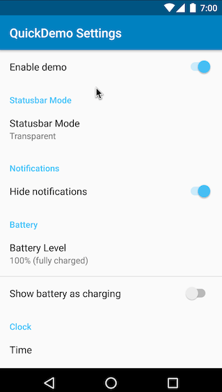

# QuickDemo

_QuickDemo_ is a Nougat 7.0 [quick settings tile](https://developer.android.com/about/versions/nougat/android-7.0.html#tile_api) for fast access to the Marshmallow 6.0 [System UI demo mode](https://android.googlesource.com/platform/frameworks/base/+/android-6.0.0_r1/packages/SystemUI/docs/demo_mode.md). The app also provides a configuration activity for customizing available demo mode settings.

Release blog post: https://pspdfkit.com/blog/2016/clean-statusbar-with-systemui-and-quickdemo/



## Requirements

* Android SDK
* Android Studio
* `adb` (for installing the app and granting the required permissions)

## Building

To build and run the app, you can open the project with Android Studio and press `Run`. Alternatively you can install the app from the command line.

```bash
cd QuickDemo/
./gradlew installDebug
```

## Setup

1. When launching the app for the first time you need to grant the `android.permission.DUMP` permission, which is required to control the System UI demo mode. You need to do this using `adb`.

  ```bash
  adb shell pm grant com.pspdfkit.labsl.quickdemo android.permission.DUMP
  ```

2. Since the System UI tuner (and its demo mode) is an experimental Android feature, you need to activate it globally.

  ```bash
  adb shell settings put global sysui_demo_allowed 1
  ```
  
## Usage

1. The app comes with a quick settings tile which you can use to quickly toggle the demo mode.  
    1. Completely open the status bar drawer, expanding all quick setting tiles.
    2. Press the edit button on top of the drawer, to show the quick setting tiles picker.
    3. Drag the QuickDemo tile to your desired position.
    4. Exit edit mode, and tap the tile.

2. You can launch QuickDemo activity to configure all displayed icons of the demo mode.
    1. You can find the activity in your app launcher.

## Feedback and contribution

Since this project is open source, feel free to use it, give feedback, or contribute in any way you find suitable.
